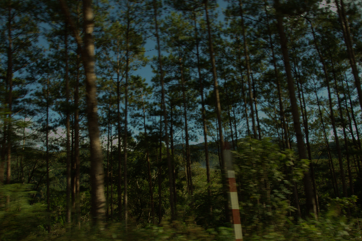
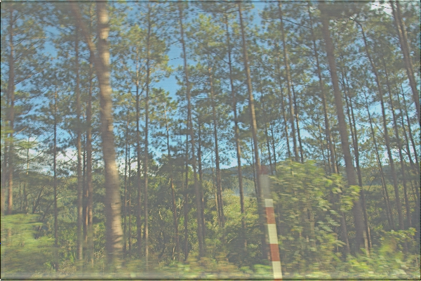

##RetinexNet Pytorch

This is a repository for code to reproduce **Deep Retinex Decomposition for Low-Light Enhancement** as a pytorch project.

In this project I basically copied the same setting in authors' [code](https://github.com/weichen582/RetinexNet), which was written in tensorflow.  

I did this project for an interview. I am no longer interested in it. I publish the code in case it might be helpful to others.  

Please refer to author's code if my code confuses you.


#### Resutls

Before; After







####Requirements

torch 1.0.0

PIL


#### Datasets

[google drive(including train and test)]() will upload soon


####Project Structure

```
- Desktop

	- Retinex_pytorch
    ......

  - final_dataset
    - trainA
    - trainB

  - test_dataset
    - testA
    - testB
   (- resultsA) # this dir will be created during test
```


#### Usage

training:

```python
python train.py
```

testing:

```python
python test.py
```

evaluating:(report PSN score between testA and resultsA; run after testing)

```python
python evaluation.py
```


####Acknowledge

[authors' website about their project](https://daooshee.github.io/BMVC2018website/), [source paper](https://arxiv.org/pdf/1808.04560.pdf), [datapipline code](https://github.com/TAMU-VITA/EnlightenGAN)